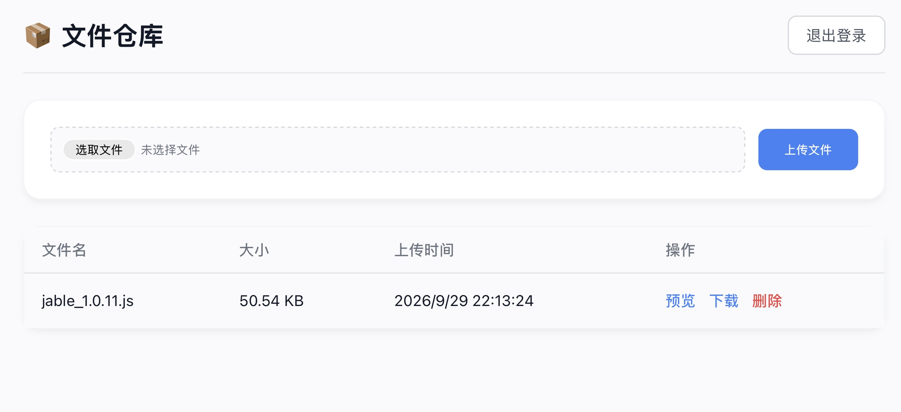

# 📦 Widgets Disk (Cloudflare Worker 版)

这是一个基于 Cloudflare Workers、KV 和 D1 数据库构建的极简无服务器（Serverless）文件管理与托管系统。无需购买云服务器，利用 Cloudflare 的免费额度即可搭建一个属于你自己的私人文件仓库。



## ✨ 特性

- **零成本部署**：完全基于 Cloudflare 的免费套餐（Workers + KV + D1）。
- **现代化 UI 面板**：全新设计的卡片式管理后台，完美适配电脑端与手机端（完美支持 iOS Safari 上传）。
- **安全鉴权**：采用自定义页面 + Cookie 验证，告别浏览器原生 Basic Auth 弹窗的简陋体验。
- **动态访问与下载**：
  - 预览/引用链接：`https://你的域名/widgets/文件名.扩展名`
  - 强制下载链接：`https://你的域名/download/文件名.扩展名`
- **全格式支持**：不限制上传文件类型，内置 MIME 路由推断，支持图片、文本、代码等多格式浏览器直接预览。

---

## 🛠 部署教程 

### 准备工作
注册并登录你的 [Cloudflare](https://dash.cloudflare.com/) 账号。

### 第一步：创建 KV 命名空间（用于存文件本体）
1. 在左侧菜单栏点击 **Workers & Pages** -> **KV**。
2. 点击右上角的 **Create a namespace**（创建命名空间）。
3. 名字随便填（例如填 `my_file_kv`），点击 **Add** 创建即可。

### 第二步：创建 D1 数据库（用于存文件列表信息）
1. 在左侧菜单栏点击 **Workers & Pages** -> **D1**。
2. 点击右上角的 **Create database**（创建数据库）。
3. 名字随便填（例如填 `file_db`），点击 **Create**。
4. 创建成功后，点击进入你刚创建的这个数据库。
5. 找到页面的 **Console**（控制台）选项卡。
6. 在输入框里粘贴下面这行 SQL 语句，然后点击 **Execute**（执行）按钮建表：
   ```sql
   CREATE TABLE IF NOT EXISTS files (filename TEXT PRIMARY KEY, size INTEGER, upload_time TIMESTAMP DEFAULT CURRENT_TIMESTAMP);
   ```

### 第三步：创建 Worker 服务
1. 在左侧菜单栏点击 **Workers & Pages** -> **Overview**（概述）。
2. 点击右上角的 **Create application**（创建应用程序），然后点击 **Create Worker**（创建 Worker）。
3. 给你的 Worker 起个名字（例如 `my-file-repo`），然后直接点击右下角的 **Deploy**（部署）。
   *(此时会部署一个默认的 Hello World 代码，请继续往下走)*

### 第四步：绑定资源与设置密码（❗最重要的一步）
在刚建好的 Worker 详情页面中，我们需要把前面建好的数据库和密码绑定给代码使用：

1. **设置管理面板密码：**
   * 点击选项卡中的 **Settings**（设置） -> 侧边栏的 **Variables and Secrets**（变量和机密）。
   * 在 **Environment Variables**（环境变量）下点击 **Add**（添加）。
   * 变量名称 (`Name`) 填入：**`ADMIN_SECRET`**  *(必须一字不差)*
   * 值 (`Value`) 填入：你要设置的管理面板登录密码（比如 `123456`）。
   * **务必点击右侧的 "Encrypt" (加密) 按钮**，然后点击 **Deploy**（部署/保存）。

2. **绑定 KV 空间：**
   * 点击侧边栏的 **Bindings**（绑定）。
   * 在 **KV Namespace Bindings**（KV 命名空间绑定）下点击 **Add**（添加）。
   * 变量名称 (`Variable name`) 填入：**`FILE_KV`** *(必须一字不差)*
   * 命名空间 (`KV namespace`)：选择你刚才在第一步创建的 KV 名字。
   * 点击 **Deploy**（部署/保存）。

3. **绑定 D1 数据库：**
   * 同样在 **Bindings**（绑定）页面，向下滚动找到 **D1 Database Bindings**（D1 数据库绑定），点击 **Add**（添加）。
   * 变量名称 (`Variable name`) 填入：**`FILE_DB`** *(必须一字不差)*
   * 数据库 (`D1 database`)：选择你在第二步创建的数据库。
   * 点击 **Deploy**（部署/保存）。

### 第五步：粘贴代码并上线
1. 资源都绑定好后，回到该 Worker 的页面顶部，点击右上角的 **Edit code**（编辑代码）按钮。
2. 左侧会显示一个代码编辑器，**删除里面的所有默认代码**。
3. 将本项目仓库中的 `index.js` 里的完整代码粘贴进去。
4. 点击右上角的 **Deploy**（部署）按钮。

---

## 💡 使用说明

1. 部署完成后，你可以直接访问 Cloudflare 分配给你的域名（通常是 `https://你的worker名字.你的子域名.workers.dev`）。
2. 打开网页后，在优美的登录卡片中输入你刚刚在第四步设置的 `ADMIN_SECRET` 密钥。
3. 进入控制台后，点击“上传文件”即可将任意文件上传至 Cloudflare 节点。
4. 列表右侧提供**预览**和**下载**按钮，你可以直接复制其链接用于你的项目引用或分享给他人。
